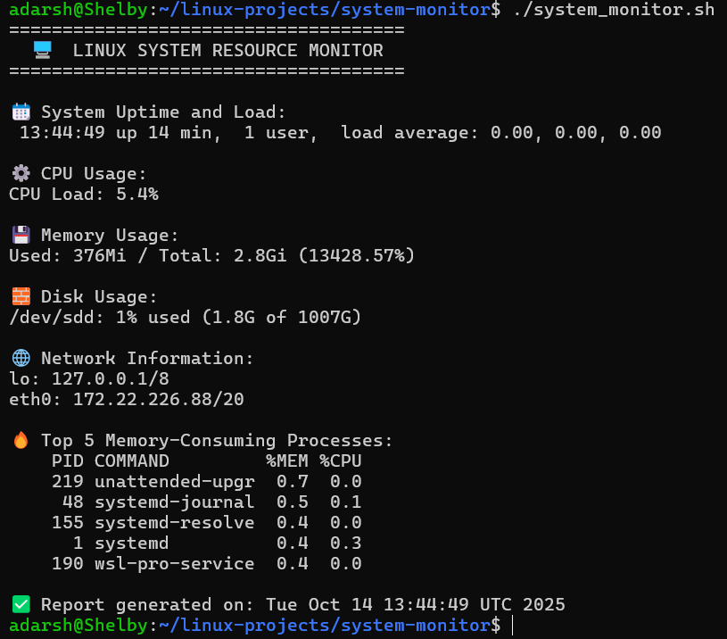

# 🖥️ Linux System Resource Monitor

### 👨‍💻 Author
**Adarsh Shivan**
GitHub: [https://github.com/adarshshivan](https://github.com/adarshshivan)

---

## 📘 Overview
The **Linux System Resource Monitor** is a Bash-based project that provides real-time insights into system performance.
It displays CPU load, memory usage, disk usage, top processes, and system uptime — all neatly formatted in your terminal.
This script is especially useful for system administrators, students, and Linux learners who want to understand how resource monitoring works without using external tools.

---

## 🧰 Features
- Real-time system monitoring
- Lightweight and fast (pure Bash)
- Cleanly formatted terminal output
- No external dependencies
- Works on all Linux-based systems

---

## ⚙️ Tools & Technologies Used
- 🐧 Linux / WSL (Ubuntu)
- 💻 Bash Scripting
- 🧮 AWK & PS Commands
-🧾 GitHub (for version control)
-✍️ VS Code / Nano (for editing scripts)

---

## 🧩 How It Works
1. Displays current date and system uptime using date and uptime.
2. Shows memory usage summary with free -h and awk.
3. Fetches disk usage with df -h.
4. Lists the top 5 memory-consuming processes using ps -eo pid,user,%mem,comm.
5. Prints the entire report in a clean, sectioned layout for easy readability.

---

## ▶️ Usage Instructions

### 1️⃣ Make It Executable (Optional)
```bash
chmod +x file_organizer.sh
```

### 2️⃣ Run the script
```bash
bash system_monitor.sh
```

or (if executable):

```bash
./system_monitor.sh
```

---

### 📂 Example Output


### ▶️ Before Running
You only have your terminal open — no resource details are displayed.

### ▶️ After Running


---

### 🎓 What I Learned

- How to use awk, ps, df, and free commands effectively
- Formatting terminal output in Bash
- Managing processes and resource data
- Creating practical Linux automation scripts
- Writing professional project documentation

---

### 🧠 Project Summary

The Linux System Resource Monitor is a Bash automation project that collects and displays real-time system statistics — including CPU load, memory usage, disk usage, top memory-consuming processes, and system uptime.
It’s designed to give users a quick overview of system performance directly from the terminal without needing any third-party applications.

This project demonstrates proficiency in:

Linux system management commands

Bash scripting and process handling

Creating readable and structured terminal outputs
